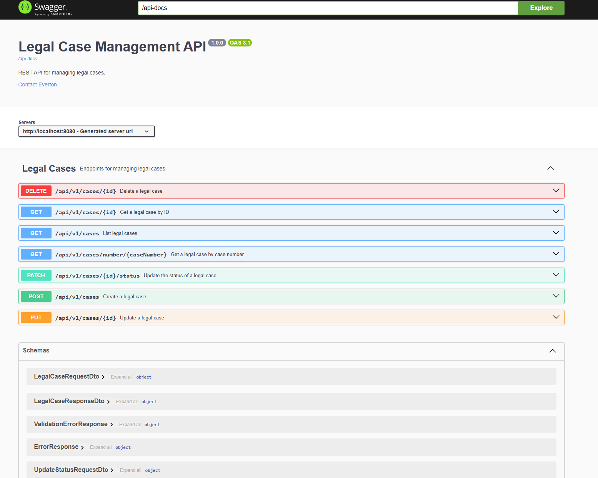
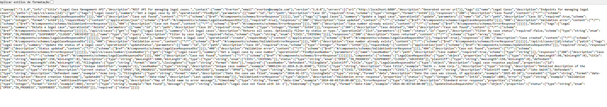

# Legal Case Management API

REST API for managing legal cases, built with Spring Boot 4, JPA and an in-memory H2 database.

## Requirements

- Java 21+
- Maven 3.9+ (or use the included `mvnw`)

## Running locally

```bash
./mvnw spring-boot:run
```

The application starts on `http://localhost:8080`.

## API docs (Swagger UI)

```
http://localhost:8080/swagger-ui.html
```


Raw OpenAPI spec:

```
http://localhost:8080/api-docs
```



## GIF showing an example of API usage


## H2 Console

```
http://localhost:8080/h2-console
```

| Field    | Value              |
|----------|--------------------|
| JDBC URL | `jdbc:h2:mem:legalcasedb` |
| Username | `sa`               |
| Password | *(empty)*          |

## Running tests

```bash
./mvnw test
```

---

## API Reference

Base path: `/api/v1/cases`

### Enums

**CaseStatusEnum**

| Value       | Description                  |
|-------------|------------------------------|
| `OPEN`        | Newly filed, not yet active  |
| `IN_PROGRESS` | Actively being processed     |
| `SUSPENDED`   | Temporarily halted           |
| `CLOSED`      | Final decision reached       |
| `ARCHIVED`    | Stored for record keeping    |

**CaseTypeEnum**

| Value       | Description          |
|-------------|----------------------|
| `CIVIL`     | Civil proceedings    |
| `CRIMINAL`  | Criminal proceedings |

---

### Endpoints

#### Create a case

```
POST /api/v1/cases
```

**Request body**

```json
{
  "caseNumber": "123456-77-88",
  "title": "Cobrança de dívida contra João da Silva",
  "description": "João da Silva comprou um carro fiat Uno de Pedro Batista no valor de 10 mil reais em 10x de 1000 reais, mas não pagou nenhuma parcela",
  "type": "CIVIL",
  "status": "OPEN",
  "plaintiff": "Pedro Batista",
  "defendant": "Dr. Reginaldo Coelho",
  "filingDate": "2026-07-17"
}
```

| Field         | Required | Type         | Constraints          |
|---------------|----------|--------------|----------------------|
| `caseNumber`  | yes      | string       | max 50 chars, unique |
| `title`       | yes      | string       | max 150 chars        |
| `description` | no       | string       | max 1000 chars       |
| `type`        | yes      | `CaseType`   |                      |
| `status`      | no       | `CaseStatus` | defaults to `OPEN`   |
| `plaintiff`   | yes      | string       | max 150 chars        |
| `defendant`   | yes      | string       | max 150 chars        |
| `filingDate`  | yes      | date         | ISO-8601             |
| `closingDate` | no       | date         | ISO-8601             |

**Responses**

| Status | Description                    |
|--------|--------------------------------|
| `201`  | Case created — returns body    |
| `400`  | Validation error               |
| `409`  | Case number already exists     |

---

#### List cases

```
GET /api/v1/cases
GET /api/v1/cases?status=OPEN
GET /api/v1/cases?type=CRIMINAL
```

| Status | Description     |
|--------|-----------------|
| `200`  | Array of cases  |

---

#### Get by ID

```
GET /api/v1/cases/{id}
```

| Status | Description     |
|--------|-----------------|
| `200`  | Case found      |
| `404`  | Case not found  |

---

#### Get by case number

```
GET /api/v1/cases/number/{caseNumber}
```

| Status | Description     |
|--------|-----------------|
| `200`  | Case found      |
| `404`  | Case not found  |

---

#### Update a case

```
PUT /api/v1/cases/{id}
```

Same body as POST. Replaces all fields.

| Status | Description                |
|--------|----------------------------|
| `200`  | Case updated               |
| `400`  | Validation error           |
| `404`  | Case not found             |
| `409`  | Case number already in use |

---

#### Partially update a case

```
PATCH /api/v1/cases/{id}
```

Only the fields included in the request body are updated. Omitted fields retain their current values.

```json
{
  "title": "Updated Title",
  "status": "CLOSED"
}
```

| Field         | Required | Type         | Constraints          |
|---------------|----------|--------------|----------------------|
| `caseNumber`  | no       | string       | max 50 chars, unique |
| `title`       | no       | string       | max 150 chars        |
| `description` | no       | string       | max 1000 chars       |
| `type`        | no       | `CaseType`   |                      |
| `status`      | no       | `CaseStatus` | sets `closingDate` automatically when `CLOSED` or `ARCHIVED` |
| `plaintiff`   | no       | string       | max 150 chars        |
| `defendant`   | no       | string       | max 150 chars        |
| `filingDate`  | no       | date         | ISO-8601             |
| `closingDate` | no       | date         | ISO-8601             |

| Status | Description                |
|--------|----------------------------|
| `200`  | Case updated               |
| `400`  | Validation error           |
| `404`  | Case not found             |
| `409`  | Case number already in use |

---

#### Update status

```
PATCH /api/v1/cases/{id}/status
```

```json
{ "status": "CLOSED" }
```

| Status | Description      |
|--------|------------------|
| `200`  | Status updated   |
| `400`  | Validation error |
| `404`  | Case not found   |

---

#### Delete a case

```
DELETE /api/v1/cases/{id}
```

| Status | Description    |
|--------|----------------|
| `204`  | Case deleted   |
| `404`  | Case not found |

---

### Error response format

```json
{
  "status": 404,
  "error": "Not Found",
  "message": "Legal case not found with id: 1",
  "timestamp": "2024-06-01T10:00:00"
}
```

Validation errors return a `fields` map instead of `message`:

```json
{
  "status": 400,
  "error": "Validation Failed",
  "fields": {
    "caseNumber": "Case number is required",
    "filingDate": "Filing date is required"
  },
  "timestamp": "2024-06-01T10:00:00"
}
```
